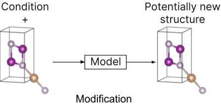
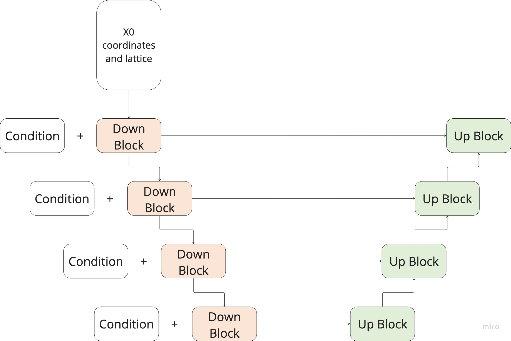

# conditional-crystal-generation

<p float="left">
    
    
</p>


## Requirements

To install requirements:

```setup
pip install -r requirements.txt
```

## Training and Evaluation

To train the models in the paper and get their validaiton results, the following notebooks should be executed:
* diffusion_generation_inference.ipynb
* diffusion_generation_train.ipynb
* diffusion_modification_train.ipynb
* flow_matching_generation_inference.ipynb
* flow_matching_generation_train.ipynb
* flow_matching_modification_train.ipynb


## Results on Generation Task
| DDPM               | DDIM      | Flow Matching N(0, 1) |  Flow Matching U(0, 1) |
| :----------------: | :-------: | :-------------------: | :--------------------: |
| 0.8074             | **0.82**  | 0.482                 | 0.8097                 |

## Results on Generation Task
| Ordinary Model | Diffusion   | Flow Matching |
| :------------: | :---------: | :-----------: |
| **0.4148**         | 0.3653  | 0.2059        |


## Model Archetecture

UNet Archetecture            |  Condition Block
:---------------------------:|:-------------------------:
|


## Repository structure
```
|── notebooks
│   ├── diffusion_generation_inference.ipynb
│   ├── diffusion_generation_train.ipynb
│   ├── diffusion_modification_train.ipynb
│   ├── flow_matching_generation_inference.ipynb
│   ├── flow_matching_generation_train.ipynb
│   └── flow_matching_modification_train.ipynb
├── requirements.txt
└── src
    ├── data
    │   ├── element.pkl
    │   └── elemental_properties31-10-2023.json
    ├── generation
    │   ├── diffusion_generation_loops.py
    │   ├── flow_matching_generation_loops.py
    │   ├── generation.py
    │   └── regression_generation_loops.py
    ├── inference
    │   └── inference_data_generation.py
    ├── losses.py
    ├── model
    │   ├── fp16_util.py
    │   ├── models.py
    │   ├── nn.py
    │   └── unet.py
    ├── modification
    │   ├── diffusion_modification_loops.py
    │   ├── flow_matching_modification_loops.py
    │   ├── modification.py
    │   └── regression_modification_loops.py
    ├── py_utils
    │   ├── comparator.py
    │   ├── crystal_dataset.py
    │   ├── sampler.py
    │   ├── skmultilearn_iterative_split.py
    │   └── stratified_splitter.py
    └── utils.py

```
